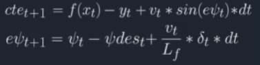

# CarND-Controls-MPC
Self-Driving Car Engineer Nanodegree Program

---

## Model Description 

### Vehicle Model
I used a kinematic model to model a vehicle in my codes. States of the vehicle is updated using parameters such as speed, acceleration, yaw angle, yaw rate, and etc; forces are not taken into account.


The state of the vehicle at each time is described by the location(x, y), speed(v), and yaw angle(psi).
In this model, the actuators are acceleration - controlled by throttle value, and yaw angle - controlled by steer angle. 
The relation between state and actuation is shown below:


For this project, I want the vehicle follow a dedicated path. Therefore two more states are added - cross track error and yaw rate error. 



The path I want the vehicle to follow is described by a funtion - f(x). This function is fitted using observed points and the detail of it will be described in a later session. Cross track error is the distance between the car and the path.

Psi_des_t is the desired yaw angle, which is tangent to the slope of the path. 

To summarize, the vehicle state consisits of 6 variables, and the actuation consists of 2 variables

### Model Predictive Controller
Model predictive controller (MPC) is leveraged to control the vehicle model to follow the dedicated path as closely as possible. 


First step of implementing a MPC is to which future state are included in the calcualtion. Then formulate all the future state using equations described in the previous session. List all the constraints of state variables and actuation variables. In this case, starting state equals to vehicle's sensor values, steer angle ranges from -25 degrees to 25 degrees, and throttle value ranges from -1 to 1. From here an optimization problem is formulated as shown below:


The objective of the optimization problem is to minimize the cost. Since I want the vehicle follow the path as closely as possible. The cost consits of cte and epsi. Also to keep vehicle moving, the cost related to speed reference is included. Besides these, actutation values and change rates of actuation values are also added to cost in order for a smoother ride. 
Since the order of magnitude and the weight of each cost component are different, multiple factors are included in the calculation. 
Here is the code for cost calculation

```c++
    // Reference State Cost
    // Define the cost related the reference state
	for (unsigned int t = 0; t < N; t++) {
	     fg[0] += CppAD::pow(vars[cte_start + t], 2)*16;
      fg[0] += CppAD::pow(vars[epsi_start + t], 2)*0.1;
      fg[0] += CppAD::pow(vars[v_start + t] - ref_v, 2)*0.05;
	}
	
	// Minimize the use of actuators.
 for (unsigned int t = 0; t < N - 1; t++) {
   fg[0] += CppAD::pow(vars[delta_start + t], 2)*80;
   fg[0] += CppAD::pow(vars[a_start + t], 2)*0.1;
   // add penalty for speed + steer
   // inspired by https://github.com/AeroGeekDean/CarND-MPC-Project/blob/master/
   fg[0] += CppAD::pow(vars[delta_start + t] * vars[v_start+t], 2)*10;
    }

 // Minimize the value gap between sequential actuations.
 for (unsigned int t = 0; t < N - 2; t++) {
   fg[0] += CppAD::pow(vars[delta_start + t + 1] - vars[delta_start + t], 2)*100;
   fg[0] += CppAD::pow(vars[a_start + t + 1] - vars[a_start + t], 2)*0.01;
    }
```
    
Finally, MPC.Solve solves the optimization problem. delta_0/max_angle and a_0 are sent to simulator as steer_angle and throttle value.

## Timestep Length and Elapsed Duration Selection
As mentioned above, the first step of MPC is to decide which future state are included in the calculation. I choose timestep length of 0.1s whilch equal to latency of 100 millisecond. It makes handling latency easier, which I will describe later. I pick 1s elapsed duration - 10 state updates. I also tried 5 future state updates and 20 future state updates, but N=10 yields better result.

## Polynomial Fitting and MPC Preprocessing

A funtion is used to represent the desired path. Such function is fitted using observed points. Before fitting the function, those points are convert from Map coordinate to Car coordinate. 


```c++
for (unsigned int i = 0; i < ptsx.size(); i++) {
						waypoints_x[i] = (ptsx[i] - px) * cos(-psi) - (ptsy[i] - py) * sin(-psi);
						waypoints_y[i] = (ptsy[i] - py) * cos(-psi) + (ptsx[i] - px) * sin(-psi);
					}
```

## Latency Handling
Previous actuation is used to update state to account for latency. With timestep of 100 millisecond equal latency, it can more accurately simulate how state is updated, and optimize cost function with latency taken into account.

```c++
if (t > 1) {  
        a0 = vars[a_start + t - 2];
        delta0 = vars[delta_start + t - 2];
      }
 ```
 
---

## Dependencies

* cmake >= 3.5
 * All OSes: [click here for installation instructions](https://cmake.org/install/)
* make >= 4.1(mac, linux), 3.81(Windows)
  * Linux: make is installed by default on most Linux distros
  * Mac: [install Xcode command line tools to get make](https://developer.apple.com/xcode/features/)
  * Windows: [Click here for installation instructions](http://gnuwin32.sourceforge.net/packages/make.htm)
* gcc/g++ >= 5.4
  * Linux: gcc / g++ is installed by default on most Linux distros
  * Mac: same deal as make - [install Xcode command line tools]((https://developer.apple.com/xcode/features/)
  * Windows: recommend using [MinGW](http://www.mingw.org/)
* [uWebSockets](https://github.com/uWebSockets/uWebSockets)
  * Run either `install-mac.sh` or `install-ubuntu.sh`.
  * If you install from source, checkout to commit `e94b6e1`, i.e.
    ```
    git clone https://github.com/uWebSockets/uWebSockets
    cd uWebSockets
    git checkout e94b6e1
    ```
    Some function signatures have changed in v0.14.x. See [this PR](https://github.com/udacity/CarND-MPC-Project/pull/3) for more details.

* **Ipopt and CppAD:** Please refer to [this document](https://github.com/udacity/CarND-MPC-Project/blob/master/install_Ipopt_CppAD.md) for installation instructions.
* [Eigen](http://eigen.tuxfamily.org/index.php?title=Main_Page). This is already part of the repo so you shouldn't have to worry about it.
* Simulator. You can download these from the [releases tab](https://github.com/udacity/self-driving-car-sim/releases).
* Not a dependency but read the [DATA.md](./DATA.md) for a description of the data sent back from the simulator.


## Basic Build Instructions

1. Clone this repo.
2. Make a build directory: `mkdir build && cd build`
3. Compile: `cmake .. && make`
4. Run it: `./mpc`.

## Tips

1. It's recommended to test the MPC on basic examples to see if your implementation behaves as desired. One possible example
is the vehicle starting offset of a straight line (reference). If the MPC implementation is correct, after some number of timesteps
(not too many) it should find and track the reference line.
2. The `lake_track_waypoints.csv` file has the waypoints of the lake track. You could use this to fit polynomials and points and see of how well your model tracks curve. NOTE: This file might be not completely in sync with the simulator so your solution should NOT depend on it.
3. For visualization this C++ [matplotlib wrapper](https://github.com/lava/matplotlib-cpp) could be helpful.)
4.  Tips for setting up your environment are available [here](https://classroom.udacity.com/nanodegrees/nd013/parts/40f38239-66b6-46ec-ae68-03afd8a601c8/modules/0949fca6-b379-42af-a919-ee50aa304e6a/lessons/f758c44c-5e40-4e01-93b5-1a82aa4e044f/concepts/23d376c7-0195-4276-bdf0-e02f1f3c665d)
5. **VM Latency:** Some students have reported differences in behavior using VM's ostensibly a result of latency.  Please let us know if issues arise as a result of a VM environment.

## Editor Settings

We've purposefully kept editor configuration files out of this repo in order to
keep it as simple and environment agnostic as possible. However, we recommend
using the following settings:

* indent using spaces
* set tab width to 2 spaces (keeps the matrices in source code aligned)

## Code Style

Please (do your best to) stick to [Google's C++ style guide](https://google.github.io/styleguide/cppguide.html).

## Project Instructions and Rubric

Note: regardless of the changes you make, your project must be buildable using
cmake and make!

More information is only accessible by people who are already enrolled in Term 2
of CarND. If you are enrolled, see [the project page](https://classroom.udacity.com/nanodegrees/nd013/parts/40f38239-66b6-46ec-ae68-03afd8a601c8/modules/f1820894-8322-4bb3-81aa-b26b3c6dcbaf/lessons/b1ff3be0-c904-438e-aad3-2b5379f0e0c3/concepts/1a2255a0-e23c-44cf-8d41-39b8a3c8264a)
for instructions and the project rubric.

## Hints!

* You don't have to follow this directory structure, but if you do, your work
  will span all of the .cpp files here. Keep an eye out for TODOs.

## Call for IDE Profiles Pull Requests

Help your fellow students!

We decided to create Makefiles with cmake to keep this project as platform
agnostic as possible. Similarly, we omitted IDE profiles in order to we ensure
that students don't feel pressured to use one IDE or another.

However! I'd love to help people get up and running with their IDEs of choice.
If you've created a profile for an IDE that you think other students would
appreciate, we'd love to have you add the requisite profile files and
instructions to ide_profiles/. For example if you wanted to add a VS Code
profile, you'd add:

* /ide_profiles/vscode/.vscode
* /ide_profiles/vscode/README.md

The README should explain what the profile does, how to take advantage of it,
and how to install it.

Frankly, I've never been involved in a project with multiple IDE profiles
before. I believe the best way to handle this would be to keep them out of the
repo root to avoid clutter. My expectation is that most profiles will include
instructions to copy files to a new location to get picked up by the IDE, but
that's just a guess.

One last note here: regardless of the IDE used, every submitted project must
still be compilable with cmake and make./

## How to write a README
A well written README file can enhance your project and portfolio.  Develop your abilities to create professional README files by completing [this free course](https://www.udacity.com/course/writing-readmes--ud777).
